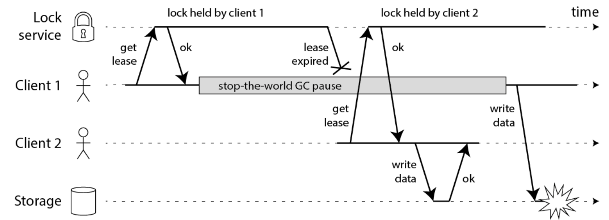
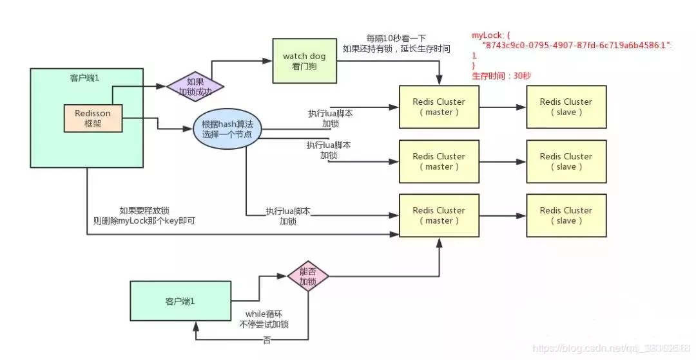

# lock原理

* [redis分布式锁-不错](https://www.cnblogs.com/crazymakercircle/p/14731826.html)

## java gc STW导致的锁过期问题


### 大概的解决方案，有：
>1： 模拟CAS乐观锁的方式，增加版本号
>2： watch dog自动延期机制




### 分布式锁一般有如下的特点：
>1，互斥性： 同一时刻只能有一个线程持有锁
>2，可重入性： 同一节点上的同一个线程如果获取了锁之后能够再次获取锁
>3，锁超时：和J.U.C中的锁一样支持锁超时，防止死锁
>4，高性能和高可用： 加锁和解锁需要高效，同时也需要保证高可用，防止分布式锁失效
>5，具备阻塞和非阻塞性：能够及时从阻塞状态中被唤醒

### 加锁lua脚本
```
/**
	 * 1,如果key不存在，（key=getLock中参数name），则 hincrby key hash-key，hash-value
	 * 2，设置key毫秒超时淘汰
	 *
	 * 3，如果key存在，并且包含元素hash-key，执行如上1和2，hash-key=commandExecutor.getConnectionManager().getId()+":"+threadId
	 *
	 * 4，如果key存在，并且不包含元素hash-key，则获取超时淘汰时间长
	 * @param waitTime
	 * @param leaseTime
	 * @param unit
	 * @param threadId
	 * @param command
	 * @param <T>
	 * @return
	 */
    <T> RFuture<T> tryLockInnerAsync(long waitTime, long leaseTime, TimeUnit unit, long threadId, RedisStrictCommand<T> command) {
        return evalWriteAsync(getRawName(), LongCodec.INSTANCE, command,
                "if (redis.call('exists', KEYS[1]) == 0) then " +
                        "redis.call('hincrby', KEYS[1], ARGV[2], 1); " +
                        "redis.call('pexpire', KEYS[1], ARGV[1]); " +
                        "return nil; " +
                        "end; " +
                        "if (redis.call('hexists', KEYS[1], ARGV[2]) == 1) then " +
                        "redis.call('hincrby', KEYS[1], ARGV[2], 1); " +
                        "redis.call('pexpire', KEYS[1], ARGV[1]); " +
                        "return nil; " +
                        "end; " +
                        "return redis.call('pttl', KEYS[1]);",
                Collections.singletonList(getRawName()), unit.toMillis(leaseTime), getLockName(threadId));
    }


```
#### lua脚本保证原子性，lua字段解释
>1,KEYS[1]:表示你加锁的那个key，比如说RLock lock = redisson.getLock(“myLock”);这里你自己设置了加锁的那个锁key就是“myLock”。
>2,ARGV[1]:表示锁的有效期，默认30s
>3,ARGV[2]:表示表示加锁的客户端ID,类似于:8743c9c0-0795-4907-87fd-6c719a6b4586:1

## lua解锁脚本
```
/**
	 * 1,如果不存在key 和hash-key，则直接退出
	 * 2，存在key和hash-key，则可重入计数减一
	 * 3，当可重入计数还大于0，则更新一下淘汰时长，还需要继续被同一个线程解锁，因为同一个线程下可重入锁被多次lock
	 * 4，如果可重入计数等于0，则可重入可以彻底释放了，则删除这个key，并发布订阅，让之前等待该锁的线程进入
	 * @param threadId
	 * @return
	 */
	protected RFuture<Boolean> unlockInnerAsync(long threadId) {
        return evalWriteAsync(getRawName(), LongCodec.INSTANCE, RedisCommands.EVAL_BOOLEAN,
                "if (redis.call('hexists', KEYS[1], ARGV[3]) == 0) then " +
                        "return nil;" +
                        "end; " +
                        "local counter = redis.call('hincrby', KEYS[1], ARGV[3], -1); " +
                        "if (counter > 0) then " +
                        "redis.call('pexpire', KEYS[1], ARGV[2]); " +
                        "return 0; " +
                        "else " +
                        "redis.call('del', KEYS[1]); " +
                        "redis.call('publish', KEYS[2], ARGV[1]); " +
                        "return 1; " +
                        "end; " +
                        "return nil;",
                Arrays.asList(getRawName(), getChannelName()), LockPubSub.UNLOCK_MESSAGE, internalLockLeaseTime, getLockName(threadId));
    }
```

### watch dog 逻辑
>watchDog添加逻辑：lock->tryAcquire->tryAcquireAsync->获取锁之后执行scheduleExpirationRenewal->{lua脚本：存在，则重试淘汰时长，默认30秒}
>创建HashedWheelTimer.HashedWheelTimeout，internalLockLeaseTime / 3间隔循环执行，默认是30/3=10秒


```
 protected void scheduleExpirationRenewal(long threadId) {
        ExpirationEntry entry = new ExpirationEntry();
        ExpirationEntry oldEntry = EXPIRATION_RENEWAL_MAP.putIfAbsent(getEntryName(), entry);
        if (oldEntry != null) {
            oldEntry.addThreadId(threadId);
        } else {
            entry.addThreadId(threadId);
            renewExpiration();
        }
    }


 private void renewExpiration() {
        ExpirationEntry ee = EXPIRATION_RENEWAL_MAP.get(getEntryName());
        if (ee == null) {
            return;
        }
        
        Timeout task = commandExecutor.getConnectionManager().newTimeout(new TimerTask() {
            @Override
            public void run(Timeout timeout) throws Exception {
                ExpirationEntry ent = EXPIRATION_RENEWAL_MAP.get(getEntryName());
                if (ent == null) {
                    return;
                }
                Long threadId = ent.getFirstThreadId();
                if (threadId == null) {
                    return;
                }
                
                RFuture<Boolean> future = renewExpirationAsync(threadId);
                future.onComplete((res, e) -> {
                    if (e != null) {
                        log.error("Can't update lock " + getRawName() + " expiration", e);
                        EXPIRATION_RENEWAL_MAP.remove(getEntryName());
                        return;
                    }
                    
                    if (res) {
                        // reschedule itself
                        renewExpiration();
                    } else {
                        cancelExpirationRenewal(null);
                    }
                });
            }
        }, internalLockLeaseTime / 3, TimeUnit.MILLISECONDS);
        
        ee.setTimeout(task);
    }


protected RFuture<Boolean> renewExpirationAsync(long threadId) {
        return evalWriteAsync(getRawName(), LongCodec.INSTANCE, RedisCommands.EVAL_BOOLEAN,
                "if (redis.call('hexists', KEYS[1], ARGV[2]) == 1) then " +
                        "redis.call('pexpire', KEYS[1], ARGV[1]); " +
                        "return 1; " +
                        "end; " +
                        "return 0;",
                Collections.singletonList(getRawName()),
                internalLockLeaseTime, getLockName(threadId));
    }
```

## 设计结构上最大的问题：异步复制，master和slave不一致，master宕机，slave则没有该锁记录，导致多端获取该锁
>最大的问题，就是如果你对某个redis master实例，写入了myLock这种锁key的value，此时会 **异步复制** 给对应的master slave实例。但是这个过程中一旦发生redis master宕机，主备切换，redis slave变为了redis master。接着就会导致，客户端2来尝试加锁的时候，在新的redis master上完成了加锁，而客户端1也以为自己成功加了锁。此时就会导致多个客户端对一个分布式锁完成了加锁。这时系统在业务上一定会出现问题，导致脏数据的产生。所以这个就是redis cluster，或者是redis master-slave架构的主从异步复制导致的redis分布式锁的最大缺陷：在redis master实例宕机的时候，可能导致多个客户端同时完成加锁