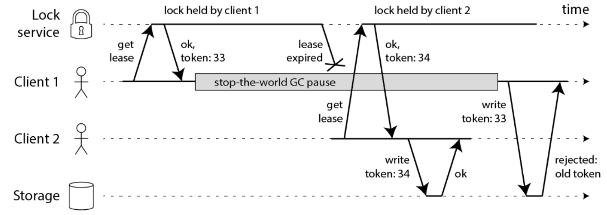

# Redis分布式锁和RedissionLock可重入分布式锁源码解读

## 分布式锁
>在分布式模式下，对一份临界资源需要跨主机跨进程跨线程互斥访问的时候，需要用分布式锁，来保证多进程有序操作

### 分布式特点
>1，互斥性：只能有一个线程只有该锁
>2，锁超时避免死锁：当该线程发生异常，能让其他线程获取
>3，容错性，高可用
>4，高性能
>5，可重入：即当前获取该锁的线程，可以继续获取执行lock获取该锁，基于可重入计数，参照JUC下ReentrantLock
>6，具备阻塞和非阻塞性：当获取不到的线程，能够被及时唤醒

### 分布式类型：
>1，基于数据库的悲观锁：X锁
>2，基于数据库的乐观锁：基于版本号
>3，基于redis的分布式锁
>4，基于zookeeper的分布式锁

>**注：这篇文章主要讲redis分布式锁，以及具体实现RedissionLock可重入分布式锁源码解读**

### 可重入分布式锁的设计
>1，要保证互斥性和可重入性：需要 **记录获取该锁的线程信息，例如线程id，以及记录可重入计数**（即lock的次数）
>2，**锁超时避免死锁：需要对redis key设置超时淘汰，但是多长时间淘汰，是个问题，后面讨论**
>3，容错性，高可用，高性能：基于redis集群，则暂时不用考虑
>4，获取不到锁的阻塞线程，需要被及时唤醒：可以基于redis发布订阅，用来通知等待锁的线程

#### 如上设计需要解决的两个问题
>1，用记录获取锁的线程id，来实现互斥以及判断可重入，但是在linux下线程id，是不保证唯一的，更何况还要跨主机进程，这个也是需要好好思考的问题
>2，避免死锁，需要设置锁超时，那设置多长时间合适？以及设置超时并获取锁之后，在java语言下，还存在因为gc，工作线程会暂定运行，即会存在STW （stop the world）问题导致多线程同时获取锁的异常情况的解决办法 

##### java gc STW （stop the word）导致的锁过期问题
>1，工作线程1，获取锁，并设置了超时淘汰时长
>2，jvm gc垃圾回收时，会暂停工作线程，即STW
>3，当工作线程1恢复工作的时候，由于STW的时长稍长，可能锁已经超时淘汰了，但是该线程还不知道，此时工作线程2去获取，也是能获取到的，导致出现多个线程获取同一个锁的异常问题，如下图所示


###### 大概的解决方案，有：
>1： 模拟CAS乐观锁的方式，增加版本号，如下图
>2： watch dog自动延期机制，在后面介绍RedissionLock时会介绍



>注意：**单机版的watch dog 并不能解决 STW的过期问题， 需要分布式版本的 watch dog， 独立的看门狗服务。因为单机版，仍然受gc STW影响。这个问题特别容易被忽略，尽管gc STW时间通常不会太长，至少理论上需要考虑**锁删除之后， 取消看门狗服务的 对应的key记录， 当然，这就使得系统变得复杂， 还要保证看门狗服务的高并发、高可用、数据一致性的问题。

## RedissionLock 大致框架逻辑图


### 锁实现的主要数据结构
>1，基于hash数据结构，保存了threadId和可重入计数，该hash下有且只有一个子元素，hincrby lockName uniqueThreadId，1
>2，pexpire lockName expireTime  ，一般30秒超时淘汰，或者自己unlock及时释放
>3，基于发布订阅实现watch dog：pulish redisson_lock__channel:{lockName} LockPubSub.UNLOCK_MESSAGE

### RedissionLock.lock
>1，锁不存在，则设置锁，线程id，和超时淘汰
>2，锁存在，可重入，则可重入计数增1
>3，获取了锁，则添加watch dog定时线程定时刷新超时淘汰时间，默认每10秒执行一次
>4，没获取到锁，则订阅锁释放通知，等待通知
```
   private void lock(long leaseTime, TimeUnit unit, boolean interruptibly) throws InterruptedException {
        long threadId = Thread.currentThread().getId();
        Long ttl = tryAcquire(-1, leaseTime, unit, threadId);
        // lock acquired
        if (ttl == null) {//是当前线程获取到锁了，并且会重新设置超时淘汰时间和自增可重入次数
            return;
        }
        //加锁操作失败，订阅消息，利用 redis 的 pubsub 提供一个通知机制来减少不断的重试，避免发生活锁。
        //活锁：是指线程 1 可以使用资源，但它很礼貌，让其他线程先使用资源，线程 2 也可以使用资源，但它很绅士，也让其他线程先使用资源。这样你让我，我让你，最后两个线程都无法使用资源

        //在lock中执行订阅，unlock-> unlockInnerAsync 则发布publish redisson_lock__channel:{lockName} LockPubSub.UNLOCK_MESSAGE=0 通知等待的线程去获取锁

        RFuture<RedissonLockEntry> future = subscribe(threadId);
        if (interruptibly) {
            commandExecutor.syncSubscriptionInterrupted(future);
        } else {
            commandExecutor.syncSubscription(future);
        }

        try {
            while (true) {
                ttl = tryAcquire(-1, leaseTime, unit, threadId);
                // lock acquired
                if (ttl == null) {
                    break;
                }

                // waiting for message
                //当前线程没有拿到锁，先在上面订阅了channel key=redisson_lock__channel:{lockName}
                //在如下则，等待在拿到锁的线程unlock之后可重入计数=0时，
                //会pulish redisson_lock__channel:{lockName} LockPubSub.UNLOCK_MESSAGE 一个信息，则唤醒等待获取锁的线程去tryAcquire

                if (ttl >= 0) {
                    try {
                        future.getNow().getLatch().tryAcquire(ttl, TimeUnit.MILLISECONDS);
                    } catch (InterruptedException e) {
                        if (interruptibly) {
                            throw e;
                        }
                        future.getNow().getLatch().tryAcquire(ttl, TimeUnit.MILLISECONDS);
                    }
                } else {
                    if (interruptibly) {
                        future.getNow().getLatch().acquire();
                    } else {
                        future.getNow().getLatch().acquireUninterruptibly();
                    }
                }
            }
        } finally {
            unsubscribe(future, threadId);
        }
    }

     private Long tryAcquire(long waitTime, long leaseTime, TimeUnit unit, long threadId) {
        return get(tryAcquireAsync(waitTime, leaseTime, unit, threadId));
    }

    private <T> RFuture<Long> tryAcquireAsync(long waitTime, long leaseTime, TimeUnit unit, long threadId) {
        RFuture<Long> ttlRemainingFuture;
        if (leaseTime != -1) {
            ttlRemainingFuture = tryLockInnerAsync(waitTime, leaseTime, unit, threadId, RedisCommands.EVAL_LONG);
        } else {
            ttlRemainingFuture = tryLockInnerAsync(waitTime, internalLockLeaseTime,//key超时淘汰 30秒=30*1000
                    TimeUnit.MILLISECONDS, threadId, RedisCommands.EVAL_LONG);
        }
        ttlRemainingFuture.onComplete((ttlRemaining, e) -> {
            if (e != null) {
                return;
            }

            // lock acquired
            if (ttlRemaining == null) {
                if (leaseTime != -1) {
                    internalLockLeaseTime = unit.toMillis(leaseTime);
                } else {
                    scheduleExpirationRenewal(threadId);//添加watch dog
                }
            }
        });
        return ttlRemainingFuture;
    } 
```


#### 加锁lua脚本
>1，逻辑调用链：lock->tryAcquire->tryLockInnerAsync
```
/**
	 * 1,如果key(lockName)不存在，（key=getLock中参数name），则 hincrby key hash-key，hash-value
	 * 2，设置key毫秒超时淘汰
	 *
	 * 3，如果key存在，并且包含元素hash-key，执行如上1和2，hash-key=commandExecutor.getConnectionManager().getId()+":"+threadId
	 *
	 * 4，如果key存在，并且不包含元素hash-key，则获取超时淘汰时间长
	 * @param waitTime
	 * @param leaseTime
	 * @param unit
	 * @param threadId
	 * @param command
	 * @param <T>
	 * @return
	 */
    <T> RFuture<T> tryLockInnerAsync(long waitTime, long leaseTime, TimeUnit unit, long threadId, RedisStrictCommand<T> command) {
        return evalWriteAsync(getRawName(), LongCodec.INSTANCE, command,
                "if (redis.call('exists', KEYS[1]) == 0) then " +
                        "redis.call('hincrby', KEYS[1], ARGV[2], 1); " +
                        "redis.call('pexpire', KEYS[1], ARGV[1]); " +
                        "return nil; " +
                        "end; " +
                        "if (redis.call('hexists', KEYS[1], ARGV[2]) == 1) then " +
                        "redis.call('hincrby', KEYS[1], ARGV[2], 1); " +
                        "redis.call('pexpire', KEYS[1], ARGV[1]); " +
                        "return nil; " +
                        "end; " +
                        "return redis.call('pttl', KEYS[1]);",
                Collections.singletonList(getRawName()), unit.toMillis(leaseTime), getLockName(threadId));
    }


```
##### lua脚本保证原子性，lua字段解释
>1,KEYS[1]:表示你加锁的那个key，比如说RLock lock = redisson.getLock(“myLock”);这里你自己设置了加锁的那个锁key就是“myLock”。
>2,ARGV[1]:表示锁的有效期，默认30s
>3,ARGV[2]:表示表示加锁的线程ID,类似于:8743c9c0-0795-4907-87fd-6c719a6b4586:1，大致是uuid：threadId，用来避免threadId重复，又可以实现互斥和可重入判断

### RedissionLock.unlock
>1，可重入计数-1，当可重入计数=0时，则发布一条消息用于通知等待的线程
>2，删除watch dog
```
  public void unlock() {
        try {
            get(unlockAsync(Thread.currentThread().getId()));
        } catch (RedisException e) {
            if (e.getCause() instanceof IllegalMonitorStateException) {
                throw (IllegalMonitorStateException) e.getCause();
            } else {
                throw e;
            }
        }
    }
  public RFuture<Void> unlockAsync(long threadId) {
        RPromise<Void> result = new RedissonPromise<>();
        RFuture<Boolean> future = unlockInnerAsync(threadId);

        future.onComplete((opStatus, e) -> {
            cancelExpirationRenewal(threadId);//删除watch dog

            if (e != null) {
                result.tryFailure(e);
                return;
            }

            if (opStatus == null) {
                IllegalMonitorStateException cause = new IllegalMonitorStateException("attempt to unlock lock, not locked by current thread by node id: "
                        + id + " thread-id: " + threadId);
                result.tryFailure(cause);
                return;
            }

            result.trySuccess(null);
        });

        return result;
    }
```

#### lua解锁脚本
```
/**
	 * 1,如果不存在key 和hash-key，则直接退出
	 * 2，存在key和hash-key，则可重入计数减一
	 * 3，当可重入计数还大于0，则更新一下淘汰时长，还需要继续被同一个线程解锁，因为同一个线程下可重入锁被多次lock
	 * 4，如果可重入计数等于0，则可重入可以彻底释放了，则删除这个key，并发布订阅，让之前等待该锁的线程进入
	 * @param threadId
	 * @return
	 */
	protected RFuture<Boolean> unlockInnerAsync(long threadId) {
        return evalWriteAsync(getRawName(), LongCodec.INSTANCE, RedisCommands.EVAL_BOOLEAN,
                "if (redis.call('hexists', KEYS[1], ARGV[3]) == 0) then " +
                        "return nil;" +
                        "end; " +
                        "local counter = redis.call('hincrby', KEYS[1], ARGV[3], -1); " +
                        "if (counter > 0) then " +
                        "redis.call('pexpire', KEYS[1], ARGV[2]); " +
                        "return 0; " +
                        "else " +
                        "redis.call('del', KEYS[1]); " +
                        "redis.call('publish', KEYS[2], ARGV[1]); " + ////在lock中有订阅这个可以，unlock 则publish redisson_lock__channel:{lockName} LockPubSub.UNLOCK_MESSAGE=0
                        "return 1; " +
                        "end; " +
                        "return nil;",
                Arrays.asList(getRawName(), getChannelName()), LockPubSub.UNLOCK_MESSAGE, internalLockLeaseTime, getLockName(threadId));
    }
```

### watch dog 逻辑
>1，watchDog添加逻辑：lock->tryAcquire->tryAcquireAsync->获取锁之后执行scheduleExpirationRenewal(创建一个定时任务，并把这个定时任务加入EXPIRATION_RENEWAL_MAP)->{lua脚本：存在，则重试淘汰时长，默认30秒}
>2，创建HashedWheelTimer.HashedWheelTimeout，internalLockLeaseTime / 3间隔循环执行，默认是30/3=10秒，去刷新超时淘汰时间
>3，watchDog删除逻辑：unlock->unlockAsync-> cancelExpirationRenewal(threadId){EXPIRATION_RENEWAL_MAP.remove}

>注意：**单机版的watch dog 并不能解决 STW的过期问题， 需要分布式版本的 watch dog， 独立的看门狗服务。因为单机版，仍然受gc STW影响。这个问题特别容易被忽略，尽管gc STW时间通常不会太长，至少理论上需要考虑**

```
 protected void scheduleExpirationRenewal(long threadId) {
        ExpirationEntry entry = new ExpirationEntry();
        ExpirationEntry oldEntry = EXPIRATION_RENEWAL_MAP.putIfAbsent(getEntryName(), entry);
        if (oldEntry != null) {
            oldEntry.addThreadId(threadId);
        } else {
            entry.addThreadId(threadId);
            renewExpiration();
        }
    }


 private void renewExpiration() {
        ExpirationEntry ee = EXPIRATION_RENEWAL_MAP.get(getEntryName());
        if (ee == null) {
            return;
        }
        
        Timeout task = commandExecutor.getConnectionManager().newTimeout(new TimerTask() {
            @Override
            public void run(Timeout timeout) throws Exception {
                ExpirationEntry ent = EXPIRATION_RENEWAL_MAP.get(getEntryName());
                if (ent == null) {
                    return;
                }
                Long threadId = ent.getFirstThreadId();
                if (threadId == null) {
                    return;
                }
                
                RFuture<Boolean> future = renewExpirationAsync(threadId);
                future.onComplete((res, e) -> {
                    if (e != null) {
                        log.error("Can't update lock " + getRawName() + " expiration", e);
                        EXPIRATION_RENEWAL_MAP.remove(getEntryName());
                        return;
                    }
                    
                    if (res) {
                        // reschedule itself
                        renewExpiration();
                    } else {
                        cancelExpirationRenewal(null);
                    }
                });
            }
        }, internalLockLeaseTime / 3, TimeUnit.MILLISECONDS);
        
        ee.setTimeout(task);
    }


protected RFuture<Boolean> renewExpirationAsync(long threadId) {
        return evalWriteAsync(getRawName(), LongCodec.INSTANCE, RedisCommands.EVAL_BOOLEAN,
                "if (redis.call('hexists', KEYS[1], ARGV[2]) == 1) then " +
                        "redis.call('pexpire', KEYS[1], ARGV[1]); " +
                        "return 1; " +
                        "end; " +
                        "return 0;",
                Collections.singletonList(getRawName()),
                internalLockLeaseTime, getLockName(threadId));
    }
```

## 设计结构上最大的问题：

>1，**异步复制，master和slave不一致，master宕机，slave则没有该锁记录，导致多端获取该锁**：就是如果你对某个redis master实例，写入了myLock这种锁key的value，此时会 **异步复制** 给对应的master slave实例。但是这个过程中一旦发生redis master宕机，主备切换，redis slave变为了redis master。接着就会导致，客户端2来尝试加锁的时候，在新的redis master上完成了加锁，而客户端1也以为自己成功加了锁。此时就会导致多个客户端对一个分布式锁完成了加锁。这时系统在业务上一定会出现问题，导致脏数据的产生。所以这个就是redis cluster，或者是redis master-slave架构的主从异步复制导致的redis分布式锁的最大缺陷：在redis master实例宕机的时候，可能导致多个客户端同时完成加锁
>2，**需要设计分布式的watch dog机制以避免GC STW问题，这个问题，在redission中，目前待后面阅读补充**

## 参考
* [redis分布式锁介绍](https://www.cnblogs.com/crazymakercircle/p/14731826.html)
* [redisLock锁介绍](https://xie.infoq.cn/article/5402bd65cbb5a64dd67376178)